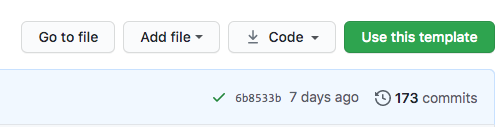

# THE CITY's Full-page Photo Scrolly Template for News Apps

[THE CITY](https://www.thecity.nyc/pages/about) is a nonprofit, nonpartisan, digital newsroom dedicated to hard-hitting reporting that serves the people of New York. We publish news apps and data graphics regularly, and we try and open source as much of our code as we can so that others can use it. You can check out a list of our recent projects on [THE CITY Projects Page](https://projects.thecity.nyc/all-projects/).

This template is what we use to generate interactive, photo-heavy, vertical scroll-based stories and publish them on the web. Check out a live example from THE CITY using this template: [Making My Force and My Face Known: Queer Wrestlers Enter the Ring in Red Hook](https://projects.thecity.nyc/queer-wrestling-red-hook/).

This project was bootstrapped with [Create React App](https://github.com/facebook/create-react-app). The deployment process is based in part on the [Baker Rig](https://github.com/datadesk/baker) project by the L.A. Times.

If you're looking to build a simpler app, you may want to check out our [Full-page React Template](https://github.com/thecityny/fullpage-react-template) or our [Multi-page Gatsby Template](https://github.com/thecityny/multipage-gatsby-template) instead.

## 🚀 Getting started

The first step is to click GitHub’s “use this template” button to a make a copy of the repository for yourself.



You’ll be asked to provide a slug for your project. Once that’s done, a new repository will be available at `https://github.com/your-username/your-slug`.

Next you’ll need to clone it down to your computer to work with the code.

Open up your terminal and cd to your code folder. Clone the project into your folder. This will copy the project onto your computer.

```sh
gh repo clone https://github.com/your-username/your-slug
```

Once the repository has finished downloading, cd into your-slug and install the Node.js dependencies.

```sh
npm install
```

Once the dependencies have been installed, you’re ready to preview the project. Run the following to start the test server.

```sh
npm start
```

Now go to `localhost:3000` in your browser. You should see a boilerplate page ready for your customizations.

## Adding Content

### Photos

All photos for your scrolly story should be placed in the folder located at `src/assets/images/scrolly-photos`. We recommend making your photos as small as possible, and compressing them using some free online resource (like [Squoosh App](https://squoosh.app/)) to optimize loading time on the scrolly story.

### Videos

You can also include videos in your scrolly story. For this, we recommend hosting your video files online (we host ours on [Amazon S3](https://aws.amazon.com/s3/)). Make sure you have a publicly accessible URL for the video that ends in `.mp4`, signifying the MP4 file format.

### Text

You can write text to go alongside each photo/video in your scrolly story inside the `src/page-content.js` file. This file contains a JS object with all of the text, alongside names for photos/videos, for each slide of your scrolly project. See `slideX` in this file for descriptions of each property and how to input your content.

### Integrations with Google Docs (OPTIONAL)

If you prefer to keep track of your content in a Google Doc instead on inside `src/page-content.js`, you can use this project's [ArchieML integration](http://archieml.org/). Make a copy of this [template document](https://docs.google.com/document/d/1OjgDSARKiCrrB2wXRZpSOTpegxK1sLfjoWHkpjiz_U8/edit?usp=sharing), fill it out, and then load it into this codebase using the `download-content` script command described below.

## Using this template

This code is free and open source and you are permitted to use for your own projects under the [Apache 2.0 License](LICENSE) included in this repository. However, before deploying anything publicly using this codebase, you must:

- Change [`_fonts/scss`](src/styles/_fonts.scss) — our fonts are proprietary and are not permitted for use outside of THE CITY's domain. Please change these fonts to ones you own publishing rights to, or use free, web-safe fonts instead.
- Remove [`logo.svg`](src/assets/images/logo.svg) — our logo is trademarked and cannot be used without THE CITY's explicit permission. Please remove this logo [from the header](src/components/PageLayout.tsx), or swap in your own logo.

Also, as part of our license, we require that any online publication of work built using this software **include a credit and
link to THE CITY**. The template includes the suggested sentence “Made with ♥ in NYC by THE CITY” in the page footer — feel free to leave that in.

Lastly, we want to hear from you! We'd love to know if you are using this code to publish your own projects. Drop us a line at [data@thecity.nyc](mailto:data@thecity.nyc).

## Available Scripts

In the project directory, you can run:

### `npm start`

Runs the app in the development mode.\
Open [http://localhost:3000](http://localhost:3000) to view it in your browser.

The page will reload when you make changes.\
You may also see any lint errors in the console.

### `DOCID=XXXXXX npm run download-content` (CUSTOM)

Runs the `downloadGoogleDocContent` function inside `src/scripts.js`. This function uses ArchieML to download content from a Google Doc and save it in a JavaScript object variable in `page-content.js` in the `src` directory.

NOTE: before running this command, you must globally install the AML Google Doc Server on your computer by running:

```
npm install -g aml-gdoc-server
```

Once installed, you then must log in to google by running:

```
aml-gdoc-server
```

and following the steps in the terminal. Once that's running, you should see a message that says "The aml-gdoc-server is up and listening at http://127.0.0.1:6006." Keep this terminal window open and start a new terminal to run further commands.

Lastly, find what google doc you want to pull content from and copy the "Document ID" from the URL, which is the long string of characters at the end of the URL. Use this ID in the above command where it says `XXXXXX`.

### `npm test`

Launches the test runner in the interactive watch mode.\
See the section about [running tests](https://facebook.github.io/create-react-app/docs/running-tests) for more information.

### `npm run build`

Builds the app for production to the `build` folder.\
It correctly bundles React in production mode and optimizes the build for the best performance.

The build is minified and the filenames include the hashes.\
Your app is ready to be deployed!

See the section about [deployment](https://facebook.github.io/create-react-app/docs/deployment) for more information.

### `npm run eject`

**Note: this is a one-way operation. Once you `eject`, you can't go back!**

If you aren't satisfied with the build tool and configuration choices, you can `eject` at any time. This command will remove the single build dependency from your project.

Instead, it will copy all the configuration files and the transitive dependencies (webpack, Babel, ESLint, etc) right into your project so you have full control over them. All of the commands except `eject` will still work, but they will point to the copied scripts so you can tweak them. At this point you're on your own.

You don't have to ever use `eject`. The curated feature set is suitable for small and middle deployments, and you shouldn't feel obligated to use this feature. However we understand that this tool wouldn't be useful if you couldn't customize it when you are ready for it.

## Deploying to AWS

We've set up automatic deployment to AWS S3 based on the [Baker Rig](https://github.com/datadesk/baker) project by the L.A. Times. See these instructions on how to set that up:

### Configuring your account

Before you can deploy an app created by this repository, you will need to configure your Amazon AWS account and add a set of credentials to your GitHub account.

First, you'll need to create two buckets in Amazon's S3 storage service. One is for your staging site. The other is for your production site. For this simple example, each should allow public access and be [configured to serve a static website](https://docs.aws.amazon.com/AmazonS3/latest/userguide/HostingWebsiteOnS3Setup.html).

The names of those buckets should then be stored as GitHub "secrets" accessible to the Actions that deploy the site. You should visit [your settings panel for your account or organization](https://docs.github.com/en/actions/security-guides/encrypted-secrets#creating-encrypted-secrets-for-an-organization). Start by adding these two secrets.

| Name                       | Value                                                  |
| :------------------------- | :----------------------------------------------------- |
| `AWS_S3_STAGING_BUCKET`    | The name of your staging bucket                        |
| `AWS_S3_STAGING_REGION`    | The S3 region where your staging bucket was created    |
| `AWS_S3_PRODUCTION_BUCKET` | The name of your production bucket                     |
| `AWS_S3_PRODUCTION_REGION` | The S3 region where your production bucket was created |

Next you should ensure that you have an key pair from AWS that has the ability to upload public files to your two buckets. The values should also be added to your secrets.

| Name                    | Value              |
| :---------------------- | :----------------- |
| `AWS_ACCESS_KEY_ID`     | The AWS access key |
| `AWS_SECRET_ACCESS_KEY` | The AWS secret key |

### Optional configurations

You can set up a [CloudFront distribution](https://docs.aws.amazon.com/AmazonCloudFront/latest/DeveloperGuide/distribution-working-with.html) on AWS for both your staging and production buckets — during deployment, Github Actions will invalidate the old distribution to refresh the cache for your site.

Once you create your distributions, copy the distribution IDs and store them as GitHub "secrets" accessible to the Actions that deploy the site.

| Name                                  | Value                                         |
| :------------------------------------ | :-------------------------------------------- |
| `AWS_STAGING_CLOUDFRONT_DISTRIBUTION` | The distribution ID for the staging bucket    |
| `AWS_CLOUDFRONT_DISTRIBUTION`         | The distribution ID for the production bucket |

### Staging your work

[A GitHub Action](https://github.com/datadesk/baker-example-page-template/actions/workflows/deploy-stage.yml) included with this repository will automatically publish a staging version for every branch. For instance, code pushed to the default `main` branch will appear at `https://your-staging-bucket-url/your-repo/main/`.

If you were to create a new git branch called `bugfix` and push your code, you would soon see a new staging version at `https://your-staging-bucket-url/your-repo/bugfix/`.

### Publishing your work

Before you send your page live, you should settle on a final slug for the URL. This will set the subdirectory in your bucket where the page will be published. This feature allows The Times to publish numerous pages inside the same bucket with each page managed by a different repository.

Step one is to enter the slug for your URL into the `.env` configuration file.

```yaml
REACT_APP_SLUG: your-page-slug
```

You should also set the domain within the `.env` configuration file to match your production bucket url.

```yaml
REACT_APP_DOMAIN: https://your-production-bucket-url/
```

It’s never a bad idea to make sure your slug hasn’t already been taken. You can do that by visiting `https://your-production-bucket-url/your-slug/` and ensuring it returns a page not found error.

Next you commit your change to the configuration file and make sure it’s pushed to the main branch on GitHub.

Visit the releases section of your repository’s page on GitHub. You can find it on the repo’s homepage.


Draft a new release.


There you’ll create a new tag number. A good approach is to start with an x.x.x format number that follows [semantic versioning](https://semver.org/) standards. 1.0.0 is a fine start.


Finally, hit the big green button at the bottom and send out the release.


Wait a few minutes and your page should show up at `https://your-production-bucket-url/your-slug/`.

## Learn More

You can learn more in the [Create React App documentation](https://facebook.github.io/create-react-app/docs/getting-started).

To learn React, check out the [React documentation](https://reactjs.org/).

### Code Splitting

This section has moved here: [https://facebook.github.io/create-react-app/docs/code-splitting](https://facebook.github.io/create-react-app/docs/code-splitting)

### Analyzing the Bundle Size

This section has moved here: [https://facebook.github.io/create-react-app/docs/analyzing-the-bundle-size](https://facebook.github.io/create-react-app/docs/analyzing-the-bundle-size)

### Making a Progressive Web App

This section has moved here: [https://facebook.github.io/create-react-app/docs/making-a-progressive-web-app](https://facebook.github.io/create-react-app/docs/making-a-progressive-web-app)

### Advanced Configuration

This section has moved here: [https://facebook.github.io/create-react-app/docs/advanced-configuration](https://facebook.github.io/create-react-app/docs/advanced-configuration)

### `npm run build` fails to minify

This section has moved here: [https://facebook.github.io/create-react-app/docs/troubleshooting#npm-run-build-fails-to-minify](https://facebook.github.io/create-react-app/docs/troubleshooting#npm-run-build-fails-to-minify)
